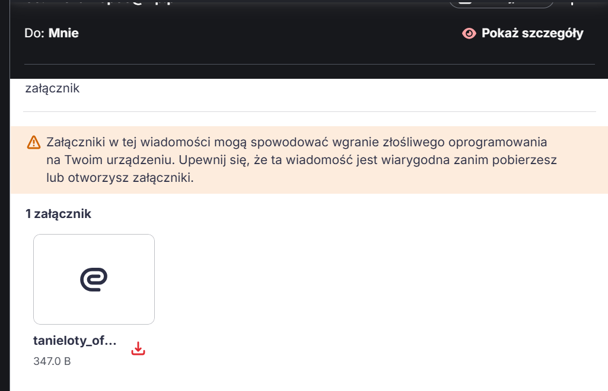
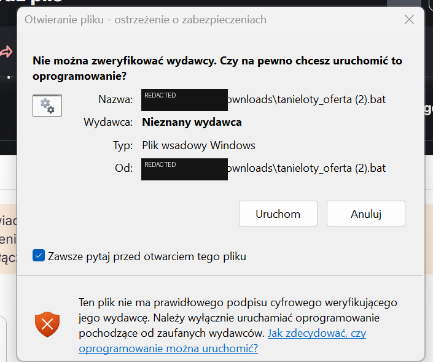
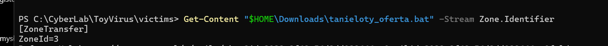
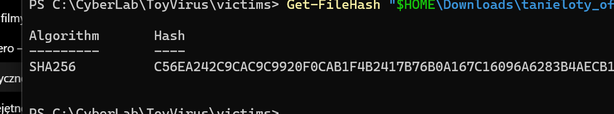
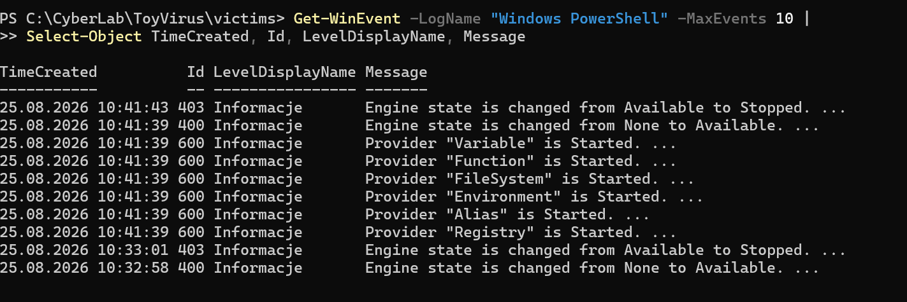
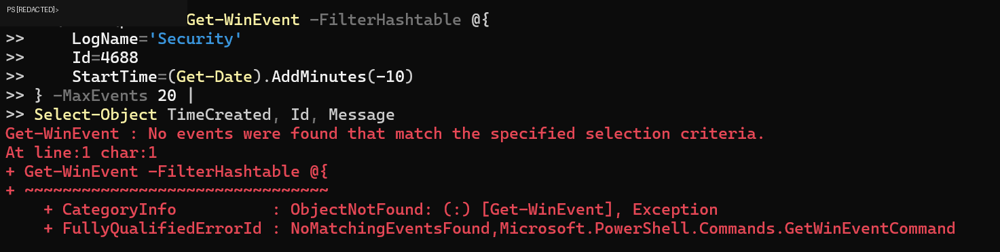

# One Execution, Two perspectives

### Offensive Execution vs. Defensive Telemetry

A small Windows security lab exploring the same execution from two perspectives: what happens during a controlled execution and what evidence is later available to a defender through Windows telemetry.

> **If an execution is visible for only a few seconds, what evidence remains for a security analyst?**

---

## Objective

The goal of this project was to compare:

- the execution perspective - delivery, security warnings and visible behavior,
- the defensive perspective - artifacts and Windows event logs available after execution.

The lab focused on the relationship between **execution, observable behavior and available telemetry**.

---

## Lab Environment

- Windows 11
- PowerShell
- Windows Event Logs
- `Get-WinEvent`
- SHA-256 hashing
- NTFS `Zone.Identifier`
- controlled email delivery

All testing was performed in a controlled environment.

---

## Scenario

**Test attachment → Email warning → Download → Windows warning → Execution → ~2-second visible console window → Artifact inspection → Windows event analysis**

The test file was intentionally simple and used only to generate observable behavior that could later be compared with system telemetry.

---

# Perspective 1 - Offensive Execution

## Attachment Delivery

The test file was delivered as an email attachment.

The email provider displayed a warning indicating that the attachment could potentially contain malicious software.



This was the first visible security layer encountered during the test.

---

## Windows Execution Warning

After downloading the file, Windows displayed an additional warning because the publisher could not be verified.



This showed that another security control was triggered independently of the email provider.

---

## Short Visible Execution

After launching the downloaded file, a console window appeared for approximately **two seconds** and then disappeared.

From the execution perspective, there was very little visible indication of what had happened.

This raised the main defensive question of the project:

> **What can be reconstructed from system artifacts and logs when the visible execution lasts only a few seconds?**

---

## File Provenance

The downloaded file contained an NTFS `Zone.Identifier` alternate data stream.

This artifact can indicate that Windows considers the file to originate from ax external source.



This provided evidence about the origin of the file independently of PowerShell event logs.

---

## File Integrity

A SHA-256 hash of the test file was collected using PowerShell.



The hash provides a stable identifier that can be used to verify whether the analyzed file remains unchanged.

---

# Perspective 2 - Defensive Telemetry

## PowerShell Event Logs

Windows PowerShell logs were inspected using:

```powershell
Get-WinEvent -LogName "Windows POwerShell" -MaxEvents 10 |
Select-Object TimeCreated, Id, LevelDisplayName, Message
```

The log contained events including:

- **Event ID 400** - PowerShell engine becoming available
- **Event ID 600** - PowerShell providers being initialized
- **Event ID 403** - PowerShell engine stopping



These events provided evidence that the PowerShell engine had been started and later stopped around the time of the test.

---

## Process Creation - Event ID 4688

An additional attempt was made to correlate the execution with Windows Security **Event ID 4688**, associated with process creation.

Example query:

```powershell
Get-WinEvent -FilterHashtable @{
  LogName='Security'
  Id=4688
  StartTime=(Get-Date).AddMinutes(-10)
}
```

The query returned no matching events.



This does **not** mean that the process was not executed.

Instead, it demonstrated an important limitation of security analysis:

> **An event may occur without the expected telemetry being available to the analyst.**

The visibility of process creation depends on system logging and audit configuration.

---

# Key Finding

### 1. Visible activity is not the same as system activity

The execution was visible for only approximately two seconds, while system artifacts and logs provided evidence after the visible activity had ended.

### 2. Security operates in multiple layers

The test encountered protections at different stages:

**Email provider → Windows execution warning → Windows logging**

Each layer provide a different perspective on the same activity.

### 3. Different data sources provide different evidence

The `Zone.Identifier`, SHA-256 hash and PowerShell event logs described different aspects of the execution.

No single source provided the complete picture.

### 4. Missing telemetry is also a finding

The absence of Event ID 4688 demonstrated that analysts cannot assume that every expected event will be available.

Telemetry depends on endpoint configuration.

---

# Main Takeaway

## **Visible activity ≠ System activity ≠ Available security telemetry**

Security analysis often required correlation between multiple data sources rather than relying on a single log.

---

# Limitations

This was a small controlled learning lab rather than a full penetration test or malware analysis environment.

The project did not include:

- Sysmon
- SIEM correlation
- EDR telemetry
- advanced PowerShell logging
- confirmed Process Creation auditing

These limitations also provide directions for the future development.

---

# Possible Next Steps

Future versions of the lab could include:

- enabling Process Creation auditing
- collecting Event ID 4688
- installing Sysmon
- comparing Windows Event Logs with Sysmon telemetry
- analyzing PowerShell Operational logs
- reconstructing a complete execution timeline
- creating a simple detection rule based on collected telemetry

---

# What I Learned

This project gave me practical experience with:

- Windows Event Logs
- `Get-WinEvent`
- PowerShell event IDs
- timeline-based log analysis
- SHA-256 hashing
- NTFS `Zone.Identifier`
- correlating multiple evidence sources
- identifying telemetry gaps
- distinguishing execution behavior from defensive visibility

---

## Final Thought

The most valuable lesson from this lab was not finding one specific event.

It was learning to ask:

> **What happened, what evidence should exist, what evidence is actually available, and why might there be a difference?**


